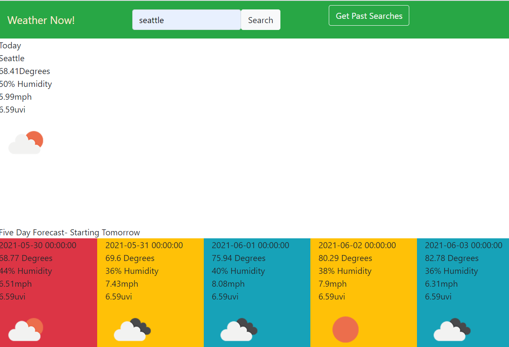

# Weather-Dashboard

by Jennifer Detmering

## Description

This is basic weather dashboard that provides a current look at weather conditions and a five-day future forecast.

#### []

## Table of Contents

1. [Installation](#installation)
2. [Usage](#usage)
3. [Technologies Used](#technologies_used)
4. [Credits](#credits)
5. [License](#license)
6. [Features](#features)
7. [Questions and Contributions](#questions_and_contributions)
8. [Tests](#tests)

## Installation-

# [Use Weather Dashboard](https://kodiakshuksan.github.io/Weather-Dashboard/)

## Usage-

## Technologies

For this project I used Visual Studio Code, HTML, CSS, Javascript, and OpenWeather Api.

## Credits-

[w3 schools](https://w3schools.com)

## License-

### [License: MIT](https://opensource.org/licenses/MIT)

## Features-

Uses OpenWeather API to get the current weather, five-day forecast, uvi, wind speed, temp, condition icon, and humidity

## Questions and Contributions-

### GitHub Profile: https://github.com/kodiakshuksan

### Email: kodiakshuksan@yahoo.com

## Tests-

none
